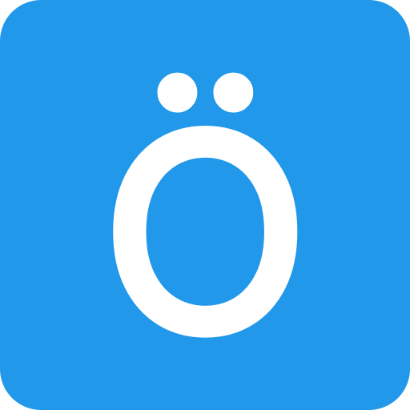
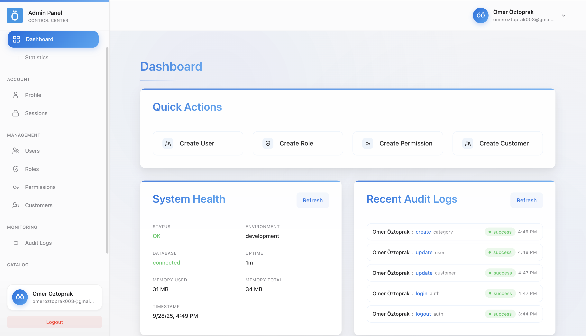
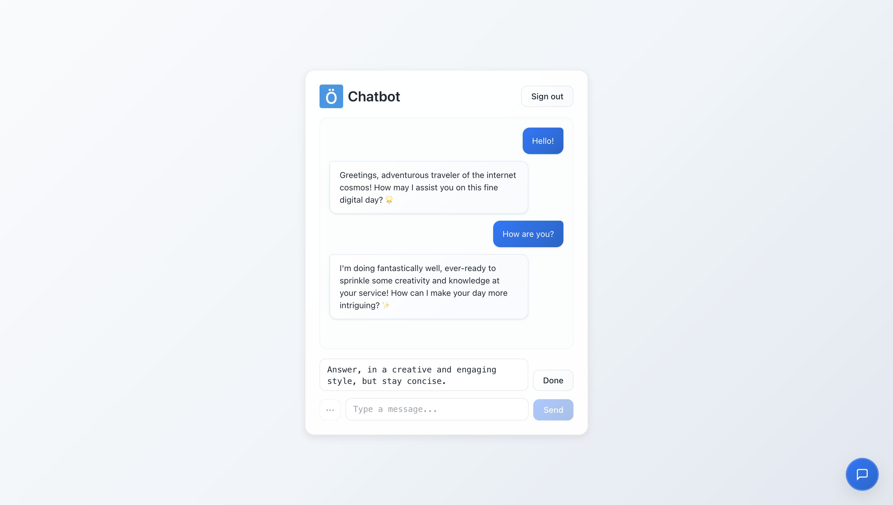
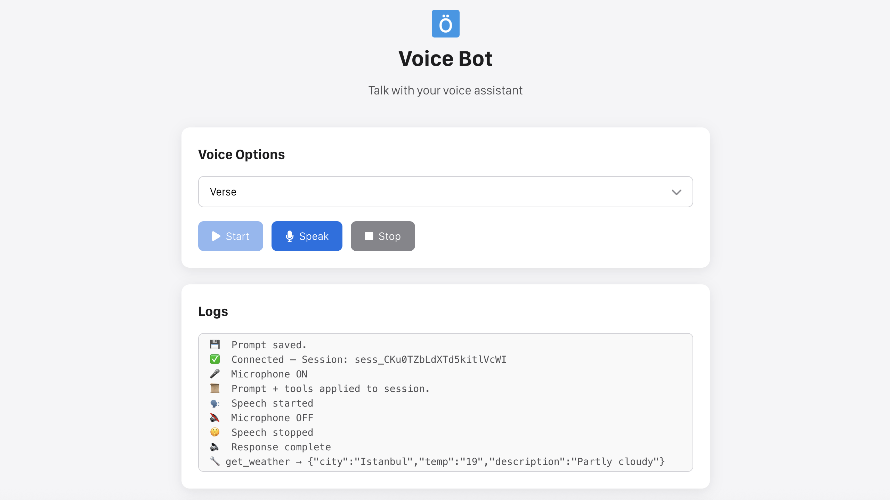
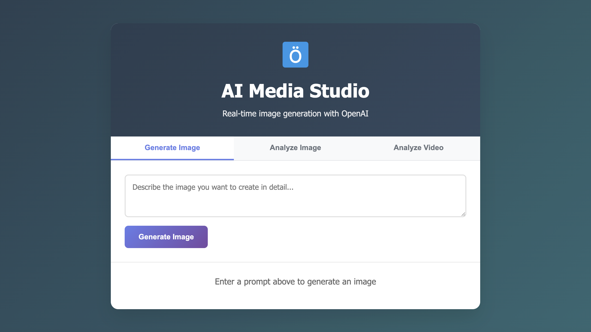

  
  
  <h1>Ömer Öztoprak</h1>
  
  

## About Me

Hello, my name is Ömer. I am a software developer and a graduate of the Software Engineering program at Beykent University. Throughout my academic journey, I did not limit myself to theoretical knowledge alone; instead, I developed numerous independent projects that enhanced both my technical and practical skills. During this process, I particularly focused on AI-powered full-stack projects, conducting in-depth studies that allowed me to graduate with a strong foundation.

Alongside my education, I completed an internship where I gained valuable experience in developing sustainable and scalable applications. I actively contributed to every stage of project lifecycles, strengthening not only my technical expertise but also my communication skills, while gaining hands-on experience in solving real-world challenges within a professional work environment.

My career goal is to become an AI Engineer specializing in developing AI-driven solutions and full-stack projects. To achieve this, I am committed to continuously improving myself by keeping up with innovative technologies and contributing to the industry through projects that create tangible value.

Portfolio: [omeroztprk.github.io](https://omeroztprk.github.io)

  
  
  
  

## My Skills

### Frontend

### Backend

### Tools & Others

## Featured Projects  

<table>
  <tr>
    <td align="center" width="50%">
       
      <h3 style="margin:5px 0;">Admin Panel Dashboard</h3>
      
A comprehensive full-stack administration platform with a customer-focused AI chatbot system.

      
<b>Tech:</b> Node.js, Express, MongoDB, Angular, OpenAI API

      Repository:
      <a href="https://github.com/omeroztprk/admin-panel-dashboard" style="margin:5px 0; display:inline-block;">admin-panel-dashboard</a>
    </td>
    <td align="center" width="50%">
       
      <h3 style="margin:5px 0;">AI Chatbot</h3>
      
A comprehensive conversational platform with real-time streaming, custom prompts, and OpenAI API.

      
<b>Tech:</b> Node.js, Express, MongoDB, Angular, OpenAI API

      Repository:
      <a href="https://github.com/omeroztprk/ai-chatbot" style="margin:5px 0; display:inline-block;">ai-chatbot</a>
    </td>
  </tr>
  <tr>
    <td align="center" width="50%">
       
      <h3 style="margin:5px 0;">Realtime Speech-to-Speech Bot</h3>
      
A comprehensive voice conversation platform with OpenAI Realtime API and WebRTC.

      
<b>Tech:</b> Node.js, Express, WebRTC, OpenAI API

      Repository:
      <a href="https://github.com/omeroztprk/realtime-sts-bot" style="margin:5px 0; display:inline-block;">realtime-sts-bot</a>
    </td>
    <td align="center" width="50%">
       
      <h3 style="margin:5px 0;">AI Media Studio</h3>
      
A comprehensive multimedia platform with image generation, video processing, and OpenAI API.

      
<b>Tech:</b> Node.js, Express, FFmpeg, OpenAI API

      Repository:
      <a href="https://github.com/omeroztprk/ai-media-studio" style="margin:5px 0; display:inline-block;">ai-media-studio</a>
    </td>
  </tr>
</table>

## GitHub Stats

### Overview

  

### Streak

  

### Top Languages

  

## Activity Graph

  

